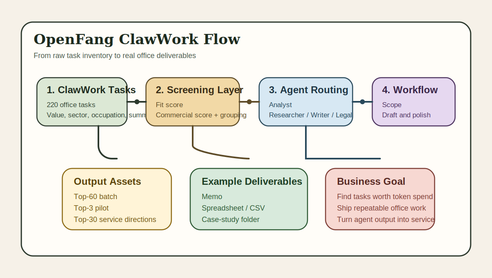

[](https://github.com/outhsics/openfang-clawwork/actions/workflows/ci.yml)
[](LICENSE)

# 💼 OpenFang ClawWork

<div align="center">

**A commercial-open-source bridge for routing real office tasks from ClawWork into OpenFang**

[](https://github.com/RightNow-AI/openfang)
[](reports/clawwork_openfang_fit_report.md)
[](data/openfang_task_batch_top60.jsonl)

English | [简体中文](README.md)

**Screen, group, and route the ClawWork tasks that are most likely to become real deliverable work inside OpenFang.**

[Quick Start](#-quick-start) • [Why It Matters](#-why-this-project-matters) • [Task Groups](#-best-fit-task-groups) • [Roadmap](#-roadmap)

</div>

---

<p align="center">
  
</p>

---

## Recruiter Snapshot

- Status: `active`
- Positioning: commercial-open-source bridge between ClawWork task inventory and OpenFang execution
- Core Value: identify the highest-value office tasks before spending agent time and tokens on weak categories
- Technical Scope: task ranking, batch export, workflow templates, OpenFang routing, execution backfill
- Delivery Signal: top-60 queue, top-3 pilot, top-30 service directions, reusable workflow payload
- Last Reviewed: `2026-03-06`

## 📖 Project Overview

### 🎯 What this project is

**OpenFang ClawWork** focuses on a more valuable question than a generic agent demo:

> Out of ClawWork's 220 office tasks, which ones are actually worth routing through OpenFang, and which ones look closest to real client work, repeatable delivery, and eventual monetization?

This repo converts the ClawWork task inventory into assets that are more useful for OpenFang:

- prioritized task batches
- agent routing hints
- workflow templates
- commercial task direction screening

### 🌟 Why this project matters

Most agent repos stop at:

- answering questions
- showing a dashboard
- finishing a benchmark run

The more valuable layer is:

- spreadsheet and finance operations
- research briefs and executive summaries
- sourcing and procurement support
- compliance and legal-adjacent documentation
- internal memos, policies, and operational docs

Those look much closer to actual business delivery than generic chatbot tasks.

---

## 💰 What kind of "money tasks" this repo is targeting

### ✅ Best opportunities

Current scoring says these groups fit OpenFang best:

1. **Spreadsheet and Financial Operations**
2. **Research, Policy and Briefing**
3. **Procurement, Sales and Vendor Strategy**
4. **Legal, Compliance and Case Documentation**

### ❌ Lower-priority categories

1. **Creative Media Production**
2. **Strict multi-artifact deck and media packages**

---

## 🧠 Recommended OpenFang agent routing

- `analyst`
  Best for spreadsheets, financial models, operational analysis, and structured outputs.

- `researcher`
  Best for source gathering, comparison, synthesis, and evidence-backed reporting.

- `writer`
  Best for memos, procedures, briefings, and client-ready rewriting.

- `legal-assistant`
  Best for compliance, contracts, case-style documentation, and regulatory framing.

- `sales-assistant`
  Best for procurement, sourcing, proposals, supplier analysis, and sales support.

---

## 📦 What is already in this repo

- [scripts/export_clawwork_openfang_assets.py](scripts/export_clawwork_openfang_assets.py)
  Generates all exported bridge assets from `task_values.jsonl`.

- [scripts/backfill_openfang_result.py](scripts/backfill_openfang_result.py)
  Writes OpenFang execution results back into a ClawWork-style `agent_data` tree.

- [data/openfang_pilot_3.jsonl](data/openfang_pilot_3.jsonl)
  The first three tasks to pilot in OpenFang.

- [data/openfang_task_batch_top60.jsonl](data/openfang_task_batch_top60.jsonl)
  The highest-priority screened batch.

- [data/top30_service_directions.jsonl](data/top30_service_directions.jsonl)
  The top 30 directions that feel closest to real client services.

- [data/grouped_summary.json](data/grouped_summary.json)
  Macro grouping summary with fit scores.

- [workflows/clawwork_doc_task_pipeline.json](workflows/clawwork_doc_task_pipeline.json)
  An example OpenFang workflow definition.

- [reports/clawwork_openfang_fit_report.md](reports/clawwork_openfang_fit_report.md)
  Human-readable task-fit report.

- [examples/cleanup-memo-case](examples/cleanup-memo-case)
  A concrete case-study folder with a task stub, memo sample, editable CSV schedule, and workflow input text.

- [examples/financial-reporting-case](examples/financial-reporting-case)
  A higher-value finance reporting case-study folder with a more commercial-looking output shape.

- [fixtures/sample_task_values.jsonl](fixtures/sample_task_values.jsonl)
  Small fixture for CI and smoke tests.

- [tests/smoke_test.py](tests/smoke_test.py)
  Minimal exporter smoke test.

---

## 🚀 Quick Start

### 1. Start OpenFang

```bash
openfang start
```

### 2. Register the bundled workflow

```bash
curl -X POST http://127.0.0.1:4200/api/workflows \
  -H 'Content-Type: application/json' \
  --data @workflows/clawwork_doc_task_pipeline.json
```

### 3. Pick one task from the pilot pack

Use the `task_summary` from [data/openfang_pilot_3.jsonl](data/openfang_pilot_3.jsonl) as workflow input:

```bash
curl -X POST http://127.0.0.1:4200/api/workflows/<WORKFLOW_ID>/run \
  -H 'Content-Type: application/json' \
  -d '{"input":"Draft a professional memo explaining a rotating cleanup schedule and recreate the schedule into an editable Excel file."}'
```

### 4. Or call OpenFang through the OpenAI-compatible API

```bash
curl -X POST http://127.0.0.1:4200/v1/chat/completions \
  -H 'Content-Type: application/json' \
  -d '{
    "model": "openfang:analyst",
    "messages": [
      {"role": "user", "content": "Build a first-pass delivery plan for this task: Create a structured Excel P&L for a music tour using reference data and executive-ready formatting."}
    ]
  }'
```

---

## 📁 Real case study

If you want the repo to feel more like a real delivery system rather than only an analysis repo, start here:

- [examples/cleanup-memo-case/README.md](examples/cleanup-memo-case/README.md)
- [examples/cleanup-memo-case/delivery/cleanup_memo.md](examples/cleanup-memo-case/delivery/cleanup_memo.md)
- [examples/cleanup-memo-case/delivery/cleanup_schedule.csv](examples/cleanup-memo-case/delivery/cleanup_schedule.csv)

This case was chosen because it is:

- low ambiguity
- clearly office-facing
- easy to route through OpenFang
- close to an actual billable internal operations deliverable

It is a better proof point than a benchmark screenshot.

---

## 📊 Higher-value finance case

For a more serious business-facing example, start here:

- [examples/financial-reporting-case/README.md](examples/financial-reporting-case/README.md)
- [examples/financial-reporting-case/delivery/executive_summary.md](examples/financial-reporting-case/delivery/executive_summary.md)
- [examples/financial-reporting-case/delivery/branch_profitability_snapshot.csv](examples/financial-reporting-case/delivery/branch_profitability_snapshot.csv)

This case is useful for explaining business value because it looks much closer to:

- monthly operating review work
- executive reporting
- standard finance packages
- repeatable reporting services

---

## 🔬 Current limitation

This repo currently works from exposed ClawWork task value metadata:

- `task_id`
- `occupation`
- `sector`
- `task_value_usd`
- `task_summary`
- `hours_estimate`

That is enough for:

- ranking
- screening
- batching
- routing
- workflow pre-wiring

But not enough for:

- full prompt replay
- reference file attachment
- end-to-end task execution parity
- lossless sync back into full GDPVal task context

Because the full task source still lives in the GDPVal parquet dataset.

So the current asset pack should be understood as:

**summary-only bridge assets**

---

## 🛠️ Development

Regenerate the exported asset pack:

```bash
python3 scripts/export_clawwork_openfang_assets.py \
  --input /path/to/task_values.jsonl \
  --output .
```

Run the local smoke test:

```bash
python3 tests/smoke_test.py
python3 tests/backfill_smoke_test.py
```

Backfill one OpenFang run into a ClawWork-style folder:

```bash
python3 scripts/backfill_openfang_result.py \
  --agent-data-root ./tmp/agent_data \
  --signature openfang-pilot-agent \
  --task-id pilot-001 \
  --date 2026-03-06 \
  --occupation "Administrative Services Managers" \
  --sector Government \
  --prompt "Draft a cleanup memo and editable schedule." \
  --payment 18.5 \
  --evaluation-score 0.84 \
  --feedback "Structured and practical." \
  --token-cost 2.75 \
  --wall-clock-seconds 1800 \
  --artifact examples/cleanup-memo-case/delivery/cleanup_schedule.csv
```

---

## 🗺️ Roadmap

- support full GDPVal parquet ingestion so tasks are no longer summary-only
- add workflow templates per task family
- add result backfill scripts from OpenFang runs into ClawWork-style logs
- improve routing heuristics beyond the current first-pass scoring
- add a lightweight dashboard for browsing the 220 tasks and their fit scores

---

## 🤝 Contributing

See [CONTRIBUTING.md](CONTRIBUTING.md). Small, sharp improvements are preferred over broad speculative rewrites.
